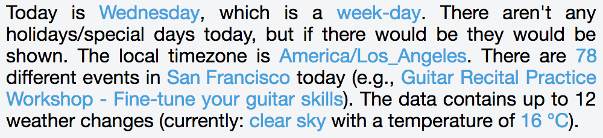
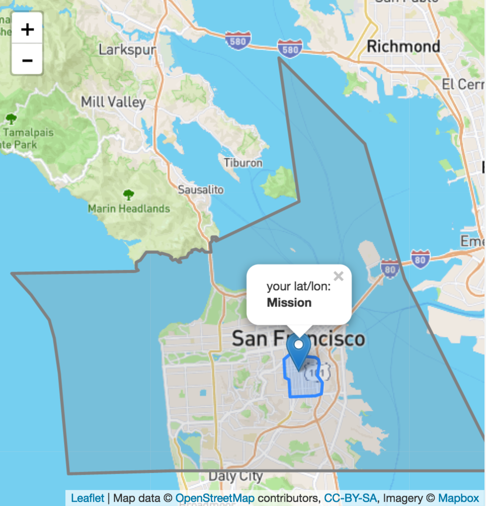

<p align="center">
  
</p>

# Breinify's API Library
[](https://badge.fury.io/bo/breinify-api)
[](https://badge.fury.io/js/breinify-api)
[](https://opensource.org/licenses/MIT)
<sup>Features: **Temporal Information**, **(Reverse) Geocoding**, **Events**, **Weather**, **Holidays**, **Analytics**</sup>

The purpose of the library is to simplify the usage of Breinify's available API endpoints, i.e., `/activity` and `/temporaldata`. Each of the endpoints has different purposes, which are explained in the following paragraphs. In addition, this documentation gives detailed examples for each of the features available for the different endpoints.

**Activity Endpoint**: The endpoint is used to understand the usage-patterns and the behavior of a user using, e.g., an application, a mobile app, or a web-browser. The endpoint offers insights through [Breinify's dashboard](https://www.breinify.com).

**TemporalData Endpoint**: The endpoint offers features to resolve temporal information like a timestamp, a location (latitude and longitude or free-text), or an IP-address, to temporal information (e.g., timezone, epoch, formatted dates, day-name),  holidays at the specified time and location, city, zip-code, neighborhood, country, or county of the location, events at the specified time and location (e.g., description, size, type), weather at the specified time and location (e.g., description, temperature).

## Getting Started

### Retrieving an API-Key

First of all, you need a valid API-key, which you can get for free at [https://www.breinify.com](https://www.breinify.com). In the examples, we assume you have the following api-key:

**938D-3120-64DD-413F-BB55-6573-90CE-473A**

### Including the Library

The library can be added as script, using:

```html
<script type="text/javascript" src="https://cdn.jsdelivr.net/breinify-api/1.0.12/breinify-api.min.js"></script>
```

If you want to use the most current **snapshot** version (only recommended for development purposes), you can also use:

```html
<script type="text/javascript" src="https://rawgit.com/pmeisen/js-gantt/master/dist/js-gantt.min.js"></script>
```

If you prefer to use **bower** the newest version can be installed using:

```bash
bower install breinify-api --save
```

## Activity: Selected Usage Examples

The endpoint is used to track the usage of, e.g., an application, an app, or a web-site. There are several libraries available to be used for different system (e.g., [iOS](https://github.com/Breinify/brein-api-library-ios), [Android](https://github.com/Breinify/brein-api-library-android), [Java](https://github.com/Breinify/brein-api-library-java), [nodeJs](https://github.com/Breinify/brein-api-library-node), [ruby](https://github.com/Breinify/brein-api-library-ruby), [php](https://github.com/Breinify/brein-api-library-php), [python](https://github.com/Breinify/brein-api-library-python)).

### Track jsFiddle Usage

The [jsFiddle (ojkvwwd9)](https://jsfiddle.net/breinify/ojkvwwd9/) shows how to use the endpoint to track the usage of this specific fiddle. There are plenty more use-cases in which the tracking of activities can be useful to understand and enhance a service. There are also several more possibilities on how to add identification, descriptions, categories, or tags. Have a look at the [additional documentation](#further-links).

## TemporalData: Selected Usage Examples

### Retrieve Client's Information (Location, Weather, Events, Timezone, Time)

The endpoint is capable to retrieve some information about the client, based on client specific information (e.g., the IP-address). The first example uses this information to retrieve some information, like the weather, events, or the timezone.

<p align="center">
  <br/>
  <sup>This is a screenshot of the jsFiddle (3wz4u5d1) created on the 29/03/2017 at 8:54 p.m.</sup>
</p>

The whole information is retrieved using the following simple JavaScript (see also [jsFiddle (3wz4u5d1)](https://jsfiddle.net/breinify/3wz4u5d1/)):

```javascript
Breinify.setConfig({ 'apiKey': '938D-3120-64DD-413F-BB55-6573-90CE-473A' });
Breinify.temporalData(function(data) {
	document.getElementById('result').innerHTML = createText(data);
});
```

### Reverse Geocoding

The `temporalData` endpoint enables you to perform reverse geocoding. To do so, simple pass in the known latitude and longitude
into the request.

```javascript
var loc = {
  latitude: 37.7609295,
  longitude: -122.4194155
};

Breinify.temporalData({additional: { location: loc }}, false, function(data) {
    // use the returned data
});
````

If you like to get further information or even visualize the country, county, city, or neighborhood the location is in, it
is possible to ask for appropriate geoJson instances and utilize them directly in, e.g., [leafLet](http://www.leafletjs.com).

```javascript
var loc = {
  latitude: latLon[0],
  longitude: latLon[1],
  shapeTypes: ['CITY', 'NEIGHBORHOOD']
};

Breinify.temporalData({additional: { location: loc }}, false, function(data) {
    // use the returned data
});
````

Have a look at [jsFiddle (qq4ryw6y)](https://jsfiddle.net/breinify/qq4ryw6y/) for a complete example.

<p align="center">
  <br/>
  <sup>This is a screenshot of the jsFiddle (qq4ryw6y), utilizing leafLet to visualize the resolved location</sup>
</p>

## Limitations

The open `/temporalData` endpoint is limited to US specific locations only. Furthermore, weather specific data is only available for the years 2016 and later.

## Further links

To understand all the capabilities of Breinify's API, you can find further information:
- the [library documentation](documentation/api.md),
- the [full API documentation](https://www.breinify.com/documentation/index.html),
- [Breinify's Website](https://www.breinify.com).
